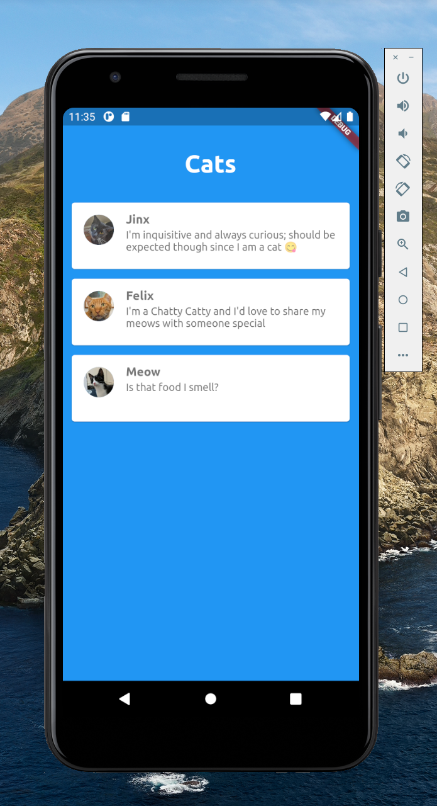
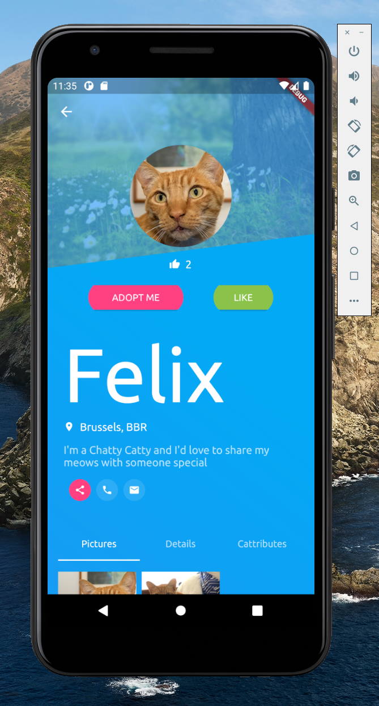
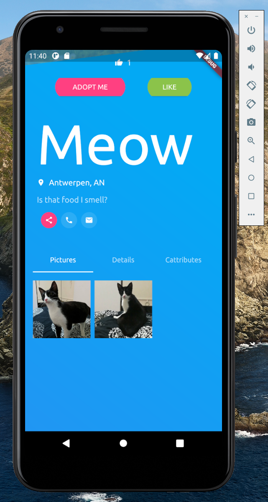
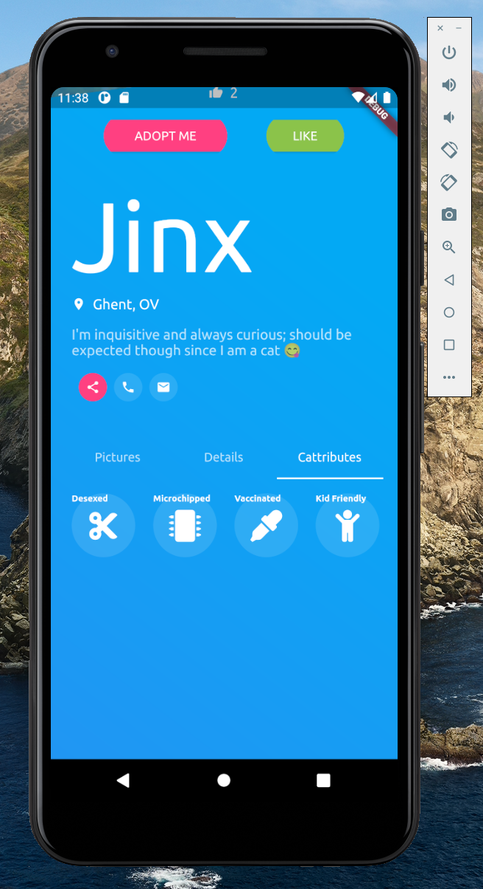

# Cat-adoption-app
A Flutter project making a Cat adoption application

## Skills applied
- Dart
- Flutter
- Fetching Json Data
- OOP
- Animation effects
- Page routing

## Features 

The App Homepage displays a list of Cats with their name and a tagline about them. When one is clicked on it routes to a details page where their location info and tagline can be read and when scrolling down it opens a footer navigation section where additional photos can be seen and also routes to a section of "Cattributes". Soon to integrated with Firebase to become serverless

   

